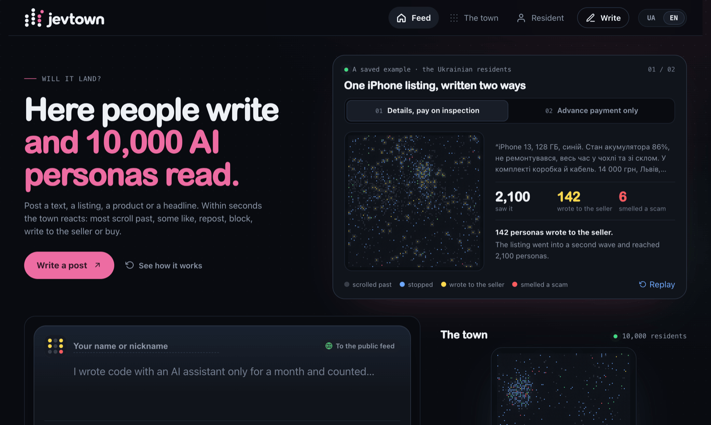

# Jevtown

Live at [jevtown.ivanhabor.com](https://jevtown.ivanhabor.com), no sign-in. [Watch the 30-second video](https://www.youtube.com/watch?v=Ktm2qwW7JAo).

<a href="https://www.producthunt.com/posts/jevtown?utm_source=badge-featured&utm_medium=badge"><picture><source media="(prefers-color-scheme: dark)" srcset="https://api.producthunt.com/widgets/embed-image/v1/featured.svg?post_id=1256567&theme=dark"></picture></a>

[](https://jevtown.ivanhabor.com)

A social network where people write and 10,000 AI personas read. Post a text, a listing, a product or a headline, and the crowd reacts within seconds: most scroll past, some like, repost, block, write to the seller or buy. Every reaction comes from [Jev](https://typesafe.ai), a model that answers typed questions with probabilities and writes no text.

What you get for a text:

- **The map of its audience.** 100×100 dots, one per persona, neighbours are similar people. A text starts with the 600 people Jev thinks it is for, and travels further only while the crowd is glad to see it. A good post visibly spreads across the map; spam, rage and scam listings die in the first wave. Every post in the feed carries its map, and the big map on the right always shows the crowd of the post you are looking at.
- **Who stopped, who liked it, who got annoyed**, by interest, job, age, temper, budget, city and what people are shopping for. Point at a group and its people light up on the map.
- **Voices of the crowd.** The people who reacted, by name: "Svitlana, 62, civil servant, Kharkiv · wrote to the seller · «Can I check it before paying?»".
- **For a listing:** what buyers would ask the seller first, out of twenty prepared questions.
- **For a product:** how many would buy at each price of a ladder you set, and which price earns the most.
- **The result in one sentence**: how far the text went, which wave stopped it, how many were glad and how many annoyed.
- **Versions.** Edit the text, show it again, see what changed, with the two texts side by side.
- **Your resident** (`/me`). Make up a person and move them into town: they live next to the 10,000, read every new post that reaches them and react like anybody else, with Jev answering for them. The town grows with every visitor. Tune the resident: say what they do with twelve posts. Then try it: eight new posts, you answer first, Jev answers without seeing that, and the page counts how often it guessed, next to how often it would have from the description alone. Every answer is kept and goes with the resident into the feed. The resident can be changed or moved out at any time.
- **A card of the post** to send to a friend: a PNG drawn in the browser with the text, the map and, largest of all, how many of the town saw it.
- A profile for every persona and every resident with what they did with recent texts, a map of the whole town to walk around (`/crowd`, with the mouse or with the arrow keys), and a link preview picture for every post.

The home page opens with a working example: one phone listing written two ways, replayed from two saved checks, so a visitor sees what the crowd does before writing anything.

A check costs from half a cent (a text that dies in the first wave) to ten cents (one that reaches all 10,000), and takes from 3 seconds to a minute. The interface comes in Ukrainian and English, and so do the personas: a text is read by the crowd that speaks its language, 10,000 Ukrainians or 10,000 English speakers, so there is nothing to choose.

## Run it

Node 22 or newer. You need a key for Jev: from [TypeSafe](https://typesafe.ai) or from [OpenRouter](https://openrouter.ai/settings/keys).

```bash
npm install
cp .env.example .env.local   # paste one of the two keys into it
npm run dev                  # http://localhost:5191
```

A check in the terminal, without the site:

```bash
npm run check -- --preset listing "iPhone 13, 128 GB, battery 86%, never repaired. 14,000 UAH, Lviv"
npm run check -- --preset product --pool en --prices 9,15,24,39 "Merino running socks that do not smell"
```

Tests need no key: `npm test`.

The Jevtown logo is drawn from two outlined vector masters, [brand/mark.svg](brand/mark.svg) and [brand/wordmark.svg](brand/wordmark.svg). `npm run build-brand` regenerates the committed website assets in `public/` from them and writes the complete SVG/PNG package to `output/branding/jevtown/production/`, which is not committed; it adds no runtime dependency or required site build step.

## How it works

1. **Personas** are computed, not stored and not generated by an LLM: `persona(pool, id)` in [public/shared/personas.js](public/shared/personas.js) always returns the same person. The id is the place on the grid, and the place decides the age and the main interest, so neighbours are alike. Jev reads a persona as one English line: `Oksana, 34, accountant, Lviv; into gardening, movies and TV series, travel; skeptical, distrusts ads and big claims; average income, careful with money`.
2. **Whom is it for.** One request scores the text against about 60 kinds of people (83 for listings and products), plus seven questions about the text itself: hatred, explicit sex, threats, private data, illegal offers, insults, keyboard mashing. An answer of 0.5 or more keeps the text out of the public feed (it is still read, the page works by link); 0.85 or more and it is not posted at all. A persona's exposure is the sum of cubes of the scores of its own attributes. [public/shared/feed.js](public/shared/feed.js)
3. **Waves.** 600 people, then 1,500, then 3,000, then everybody else. One request to Jev carries the text once and 100 personas, one choice question each; the reaction of each persona is drawn from the probabilities Jev returned, seeded by the persona and the version, so a reload shows the same crowd. A wave sends the text further when glad reactions outweigh sorry ones by at least 0.1 of the wave; after the first wave people are ranked by what their kind actually did, not by what was predicted.
4. **Follow-up.** For a listing and a product, the people who stopped get one more question.
5. **Everything on a post page** is counted from three stored bytes per persona: what it did, which wave reached it, and what it answered to the follow-up question. [public/shared/summary.js](public/shared/summary.js)

6. **Residents.** What a visitor types becomes the same kind of line a persona has, with the resident's own words added; Jev reads the name, the job, the city and those words before anybody else sees them, with the questions a post is asked. A resident's id continues the crowd's (10000, 10001, …), so everything that works by id works for them: the feed algorithm, the stored bytes, the map, where they fill rows under the square of the 10,000. When a resident moves out, the description is wiped and one of the 10,000 kinds of people takes the house, so the reactions stored for that id keep a face. The visitor's answers to the quiz posts in [public/shared/quiz.js](public/shared/quiz.js) are all kept; when Jev answers for the resident, in a test round or in the feed, the six answers nearest to the post go into the question. For a quiz post near means written the same way or on the same topic; for a post in the feed, on one of the interests Jev scored highest for it. A resident's question is about four personas long, so a request takes fewer people when residents are in it. A test round of eight posts costs about $0.0005. [public/shared/resident.js](public/shared/resident.js)
7. **Every post is on its own.** The town keeps no memory of an author: whoever followed or blocked after one post meets the next one like anybody else, so the same text gets the same crowd whatever was posted before it.

What Jev is asked, word for word, is in [public/shared/presets.js](public/shared/presets.js) and [public/shared/requests.js](public/shared/requests.js). The numbers behind the wave sizes, the rule and the request size are in [docs/measurements.md](docs/measurements.md): personas move the answers several times over, 200 personas in one request answer the same as one, the feed algorithm's first 500 people hold 83 to 97% of what the best possible 500 would, six near answers of a person lift Jev's guesses about them from 0.49 to 0.72.

## The layout

| Path | What is there |
|---|---|
| `public/shared/` | the engine, shared by the Worker, the browser and the terminal |
| `public/` | the interface: `app.js` (pages), `grid.js` (the map), `card.js` (the card of a post), `showcase.js` (the example on the home page), `i18n.js` (every word, twice); no framework, no build step |
| `public/examples/` | the two saved checks the home page replays |
| `worker/` | one Cloudflare Worker: the API, the link preview picture, the page head |
| `worker/crowd-*.bin` | the attributes of every persona, packed; rebuilt by `npm run build-crowd` after a change to the vocabularies |
| `migrations/` | the D1 schema |
| `scripts/` | `check.js` for the terminal, `probe.js` and `resident-probe.js` for the measurements |

One Worker on Cloudflare's free plan, D1, no runtime dependencies. A free invocation may make 50 outgoing requests and use 10 ms of CPU, so the browser drives a check: `POST /api/check` scores the text and plans the first wave, `GET /api/batch` asks Jev about 100 people, `GET /api/wave` closes the wave and decides whether the text travels further. Which people are asked is decided by the Worker alone, so nobody can spend the key on a crowd of their choosing. An author is a secret cookie: it lets its holder add a version to their post, and it owns the resident its holder moved in. The name over a post is only a label, and there are no accounts.

## Deploy your own

```bash
npx wrangler d1 create jev-crowd          # put the printed database_id into wrangler.jsonc
npx wrangler secret put TYPESAFE_API_KEY  # or OPENROUTER_API_KEY
npm run deploy
```

The limits are plain variables in `wrangler.jsonc`: checks per address per day, dollars per day for everybody together, and how many waves a text may travel. One TypeSafe key gives 200 to 460 personas a second, which is one to three texts a minute reaching the whole crowd, or twenty to forty-five stopping after the first wave. Closing a wave takes about 5 ms of CPU; if the free plan's 10 ms ever becomes a problem, the paid plan removes it.

## License

MIT
